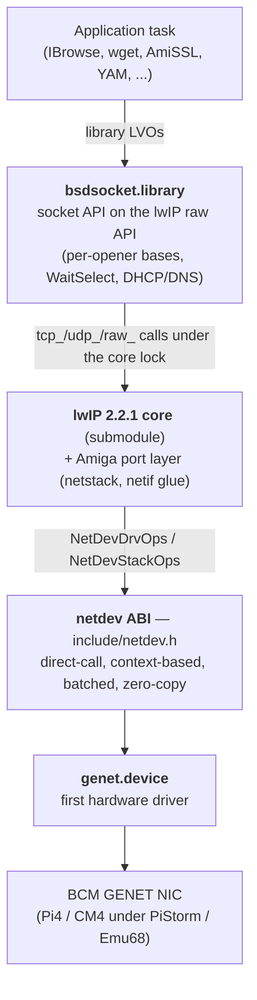

# lwip-amiga — architecture

A modern TCP/IP stack for AmigaOS 3.2 (m68k), built bottom-up as three layers on top of
a fresh network driver ABI:

Two invariants hold across the whole diagram:

- **The stack never allocates packet memory.** RX buffers are allocated, DMA-filled, and
  owned by the driver; the stack borrows them and returns them via a release hook. TX
  memory is stack-owned but drawn from a DMA allocator the driver provides at attach. This
  is what makes the datapath zero-copy and DMA-correct on a platform where only the
  driver knows which RAM its engine can reach.
- **A single core semaphore serializes all lwIP access, and Exec signals do the blocking.**
  There is no lwIP worker thread; callers run stack code in their own context under the
  lock, and blocking sockets sleep on an Exec signal — no lost wakeups.

Scope is IPv4 + TCP + UDP + ICMP + DHCP client + DNS resolver. IPv6 is compiled out.

---

## Layer 1 — `bsdsocket.library` (`src/bsdsocket/`)

The application-facing API, compatible with the AmiTCP/Roadshow contract documented in
NDK 3.2 (`bsdsocket_lib.sfd`). It is a classic AmigaOS **per-opener child-base** library:
the root base holds global state, and each `OpenLibrary()` copies the whole base — jump
table included — so every opening task gets its own `errno`, fd table, wait signal and
`WaitSelect` timer (`main.c` `LibOpen`). `SB_ROOT(base)` reaches the root from any child.

- **Sockets map directly onto lwIP pcbs.** Each `SbSocket` wraps one `tcp_pcb` / `udp_pcb`
  / `raw_pcb`. `socket`→`tcp_new`/`udp_new`/`raw_new`, `connect`→`tcp_connect`,
  `bind`→`tcp_bind`/`udp_bind`, `listen` wires `tcp_accept` (`sb_api.c`, `sb_socket.c`).
- **TX** copies app data into the DMA-backed lwIP heap (`tcp_write(..., COPY)` +
  `tcp_output`; UDP/RAW allocate a `PBUF_RAM`). **RX** keeps the driver's zero-copy pbufs
  until the app buffer — one copy, done with `pbuf_copy_partial`, then `tcp_recved`
  reopens the window.
- **Blocking model** (`sb_socket.c`): lwIP completion callbacks record readiness/events
  under the lock and `Signal()` the owning task. A blocking call clears its signal under
  the lock before waiting, so a wakeup can never be missed. Break signals (Ctrl-C by
  default) surface as `EINTR` and are re-posted. `SO_SNDTIMEO`/`SO_RCVTIMEO` add a
  per-call deadline via the opener's `timer.device` request (`sb_wait_to`).
- **The in-library stack task** (`sb_stack.c`) is a DOS process started under the root's
  open lock by the first `OpenLibrary()`. It reads `ENV:netstack.prefs` (`sb_config.c`:
  driver selection from `DEVS:Networks/`, DHCP or a static address, DNS, hostname — flat
  `KEY = VALUE`, every key optional, missing file = DHCP on `networks/genet.device`
  unit 0), initializes `netstack`, attaches the configured driver over the netdev ABI,
  brings the interface up, then ticks `sys_check_timeouts()` every 100 ms until library
  expunge. It runs at **priority 10** (above the dynamic-scheduler band, matching the
  driver's unit task) so it is not starved by CPU-bound application tasks.

The socket-call surface, resolver, event API and inet utilities live in `sb_api.c`,
`sb_select.c`, `sb_misc.c`, `sb_misc2.c` and `sb_gai.c`; the generated LVO jump table is
`vectors.c` (139 slots emitted from the SFD by `scripts/gen-vectors.py`).

Interface **status** is read-only (`sb_ifquery.c`): the Roadshow interface-query LVOs
(`ObtainInterfaceList` / `QueryInterfaceTagList`) report the live netif's address, mask,
MTU, MAC, link state and DNS, which the bundled `netinfo` CLI prints ifconfig-style. The
interface-*config* LVOs are declined (the stack is configured only from
`ENVARC:netstack.prefs`); they refuse with `EINVAL`.

## Layer 2 — lwIP core + Amiga port layer (`lwip/`, `port/amiga/`)

lwIP 2.2.1 is a git submodule, forked from `STABLE-2_2_1_RELEASE` — all Amiga-specific code lives in the port layer, which lwIP is
designed to keep separate.

- **The unsent-tail patch** (the fork's one divergence, written to be upstreamable — it
  resolves lwIP's own `@todo` in `tcp_out.c`): `struct tcp_pcb` gains `unsent_tail`,
  a cached pointer to the last node of `pcb->unsent` (invariant: NULL iff `unsent` is
  NULL, maintained at every queue mutation). Before it, `tcp_write` and
  `tcp_enqueue_flags` walked the whole unsent queue per call to find the tail; with
  `TCP_SND_BUF` = 1 MB that queue holds ~700 segments and `tcp_write` runs ~2200×/s
  during a saturated upload, so the O(n) walks were a measured hot spot (Phase T
  profiling, docs/TODO.md). A walk-and-compare self-check exists behind
  `TCP_UNSENT_TAIL_DBGCHECK` (enabled in the DEBUG_HIGH tier only — it re-adds the
  walk the cache removes).

- **Runtime model** (`lwipopts.h`): `NO_SYS=1` with external serialization — the
  core-locking idea implemented over an Exec `SignalSemaphore` instead of lwIP's own
  `tcpip_thread`. No lwIP code ever runs in interrupt context (Exec semaphores cannot be
  taken from interrupts).
- **The core lock** is the single `netstack.ns_Core` semaphore (`netstack.c`
  `netstack_lock`/`unlock`). It brackets every entry into lwIP and has exactly three
  customers:
  1. **application tasks** — socket calls run stack code in caller context under the lock;
  2. **the driver task** — injects received frames via `netif->input` under the lock;
  3. **the stack task** — runs lwIP timeouts (retransmit, DHCP renew, DNS) only.
- **Time / RNG / heap** (`netstack.c`): `sys_now()` derives monotonic milliseconds from
  the `timer.device` EClock; `LWIP_RAND` is an xorshift; the lwIP heap
  (`MEM_CUSTOM_*` → `netstack_malloc`/`free`) routes every `PBUF_RAM`/TX payload to the
  active driver's DMA allocator, with an 8-byte origin header so frees route correctly
  across attach/detach (and an `AllocMem` fallback when no NIC is attached).

## Layer 3 — netif ↔ netdev glue (`port/amiga/netdev_if.c`)

This binds a lwIP `netif` to a netdev driver. `netdevif_create` allocates the RX wrapper
pool (sized from the driver's advertised `ndc_RxPoolBufs`), adds the netif with
`ethernet_input`, and programs the per-netif checksum switches from the negotiated caps
(disabling lwIP's own TCP/UDP checksum gen/check where the hardware offloads it). The
glue also computes the RX-hold budget the opener declares at ATTACH
(`netdevif_rx_hold_budget`: receive windows × expected streams + slack — port-layer
knowledge the exec side doesn't have).

- **TX** (`ndif_linkoutput`): converts a pbuf chain into a `NetDevSg[]` scatter-gather
  list, computes the L4 checksum start/insert offsets and seeds the pseudo-header,
  `pbuf_ref`s the frame as the completion cookie, and calls `ndo_TxSubmit`. `nso_TxDone`
  frees completed cookies.
- **RX** (`ndif_rx_input`): folds/verifies the RAW checksum of each frame in a pre-pass
  *before* taking the core lock (the fold reads only frame bytes, and `nso_RxInput` runs
  on the driver's unit task alone), then, under the lock, wraps each surviving buffer as
  a zero-copy `pbuf_custom` and feeds `ethernet_input`. Freeing the pbuf calls
  `ndo_RxRelease(cookie)`, recycling the buffer to the driver.
- **Link**: `nso_LinkChange` drives `netif_set_link_up`/`down`.

---

## The `netdev` driver ABI (`include/netdev.h`)

`netdev` is a clean-break replacement for SANA-II between the stack and NIC drivers. The
header is the normative, permissively-licensed public contract — any driver or stack may
implement it. It follows the fleet's context-ABI idiom (proven by `xhci.device`): ROM-able
drivers carry no writable globals, so every exported call takes an explicit context as its
first argument.

- **Control ops are synchronous `IOStdReq` commands** (`NETDEV_CMD_*`, base `0x8900`):
  ATTACH, START, STOP, DETACH, GET_LINK, GET_STATS, SET_COALESCE, SET_MAC, and the
  declarative RX filter. They are serialized by the driver's unit task. The base sits in
  the NSD third-party command area (the NSD standard reserves `0x4000-0x7FFF` and
  `0xC000-0xFFFF` for the OS); fleet allocations: nvme passthrough `0x8020..0x8024`,
  xhci context ops `0x8800..0x881f`, netdev `0x8900..0x891f`.
- **The datapath is direct C calls**, exchanged once at ATTACH. Two tables cross the
  boundary: `NetDevDrvOps` (driver provides `ndo_TxSubmit`, `ndo_RxRelease`,
  `ndo_DmaAlloc`, `ndo_DmaFree`) and `NetDevStackOps` (stack provides `nso_RxInput`,
  `nso_TxDone`, `nso_LinkChange`). ATTACH negotiates the ABI version and the RX pool:
  the stack declares its concurrent-hold budget (`nda_RxHoldReq`, derived from receive
  windows × expected streams) and the driver answers with the enforced bound in
  `NetDevCaps.ndc_RxPoolBufs` (ring + budget, clamped to its own limits — how many RX
  buffers the stack may hold). Buffer *geometry* stays driver-internal; only the count
  crosses the ABI. ATTACH likewise negotiates the MTU (`nda_MtuReq` in, `ndc_Mtu` out):
  GENET pins 1500, but the field lets a jumbo-capable driver raise it, and
  `NDCF_RX_SCATTER` + `NDRF_SOP`/`NDRF_EOP` reserve multi-buffer RX for frames larger than
  one descriptor — so the frozen ABI covers jumbo without a future layout break.

Design choices worth knowing:

- **Split buffer ownership: driver-owned RX, stack-owned-but-driver-allocated TX.** Only
  the driver knows what its DMA engine reaches, so RX geometry, headroom, ring depth and
  copy-break policy stay entirely driver-internal and never appear in the ABI; the stack
  wraps handed-up buffers as custom pbufs whose free recycles them. TX draws from the
  driver's DMA allocator and submits scatter-gather lists. No lwIP types cross the ABI, no
  bounce buffers, no copies either way.
- **Batched by design.** TX submits an array of descriptors per doorbell; RX delivers a
  batch of filled buffers per lock acquisition; recycling is batched too. Because pbuf
  free runs in application-task context, the driver's recycle path is foreign-task-safe
  (a lock-free SPSC ring).
- **Prefix-consume on both batched paths.** `ndo_TxSubmit` and `nso_RxInput` each return
  an accepted/consumed count — one integer encodes partial success, and the tail is
  unambiguous. TX retry is event-driven: `nso_TxDone` is the "ring has space" signal.
- **Checksum offload is offset-based** (TX carries csum start/insert offsets, not protocol
  enums — protocol-agnostic and exactly what the hardware implements), with two RX modes:
  `CSUM_VALID` for engines that verify and `CSUM_RAW` for engines that just sum (GENET);
  the glue folds RAW sums against the pseudo-header. The IPv4 header checksum stays in
  software.
- **VLAN is in-band software (802.1Q), with hardware offload reserved.** GENET has no HW
  tag insert/strip, so the tag rides inside the frame and lwIP's VLAN hooks tag/filter a
  single configured VID (`VLAN =` prefs key). The checksum offloads stay on for tagged
  frames because the offset helpers key off the VLAN-shifted L3 position (as mainline Linux
  does). The ABI reserves `ntd_VlanTci`/`nrd_VlanTci` + the `NDTF_VLAN_INSERT`/
  `NDRF_VLAN_STRIPPED` flags + `NDCF_VLAN_TX_INSERT`/`NDCF_VLAN_RX_STRIP` caps so a future
  NIC with hardware insert/strip needs no layout break.
- **Cache maintenance is driver-side only** — the driver knows DMA timing and the platform
  contract (68040 cache-line ownership), keeping the port layer platform-agnostic.
- **Quiesce is exact.** STOP completes every in-flight TX cookie before replying; DETACH
  then requires all RX cookies released and all driver-allocated DMA memory freed, so
  after DETACH no pointer of either side survives in the other.

### Mapping to GENET (the first driver)

| ABI element | GENET reality |
|---|---|
| `NDTF_L4CSUM` + csum start/offset | TSB (transmit status block) offset-based checksum engine (`DMA_TX_DO_CSUM`) |
| `NDRF_CSUM_RAW` + raw sum | RXCHK raw checksum in the 64-byte RSB (`RBUF_64B_EN`) |
| VLAN (`NDCF_VLAN_*` caps) | not advertised — no HW tag offload; tags handled in-band by lwIP |
| `ndc_Mtu` / `nda_MtuReq` | pinned at 1500 (`ENET_MAX_MTU_SIZE` budgets the tag; jumbo not wired) |
| RX headroom for the RSB | driver-internal, never crosses the ABI |
| `ndo_TxSubmit` SG segments | one GENET descriptor per segment; `ndc_TxMaxSegs` bounds a packet |
| `ndo_DmaAlloc` | emu68-common `dma_mem` pool (Emu68 expansion RAM only) |
| `NETDEV_CMD_SET_COALESCE` | DMA ring timeout + MBUF_DONE thresholds |
| RX filter / multicast | MDF exact-match slots, all-multi fallback on overflow |

---

## Platform constraints

These are inputs to every decision above:

- **PiStorm/Emu68 PCIe DMA reaches only the RAM Emu68 itself provides** (pri-40 expansion
  memory) — not Chip RAM, not motherboard or Zorro Fast RAM, and not unaligned buffers.
  Reachability is the emu68-common `dma_mem` predicate, strictly driver-side knowledge —
  hence the stack never `AllocMem`s packet memory; it always comes through the driver's
  DMA allocator.
- **Exec semaphores are task-context only** → no stack entry from interrupts, ever.
- **68k is big-endian = network byte order** → no swapping on header-field access.
- Emu68 RAM is ARM-speed, so the one unavoidable copy (at the socket boundary) is cheap
  when both sides are Emu68 expansion RAM, which applications get by default.

---

## Multiple interfaces — design headroom

v1 drives exactly one NIC, but the design deliberately leaves multi-interface support
unblocked. What is already multi-ready:

- **The ABI is fully per-context**: every `ndo_*`/`nso_*` call carries a context, ATTACH
  is per-unit, and the only identity the ABI carries is `ndc_Mac`. Interface selection —
  (device name, unit) — correctly lives outside the ABI, in the opener.
- **The glue is parameterized**: `netdev_if.c` recovers its `NetdevIf` from `nif->state`
  everywhere; multiple instances would coexist as-is.
- **lwIP and the socket layer iterate**: the multi-netif list is compiled in
  (`NETIF_FOREACH` is already used), DHCP is per-netif, DNS is global by design.
- **The config schema reserves the extension**: unprefixed `netstack.prefs` keys are
  interface 0; a future `IFn_` prefix (`IF1_DEVICE`, `IF1_MODE`, ...) adds interfaces
  without a format break (unknown keys are ignored today).

The blockers, in ascending difficulty:

1. *Cosmetic*: the fixed netif name `"nd"` and the unconditional `netif_set_default` —
   index the name, make the default route config-driven.
2. *Structural, small*: the single `NetdevIf` embedded in the stack task's context and
   the one-shot up/down path — becomes an array of interface slots driven by an `IFn_`
   config loop.
3. *The hard one*: `netstack.ns_ActiveNetdev` routes the **entire** lwIP heap — every
   `PBUF_RAM`/TX allocation — to one driver's DMA allocator, and lwIP allocates TX pbufs
   *before* routing picks the egress netif. Preferred resolution: a shared stack-owned
   DMA pool — every candidate NIC on this platform shares the PiStorm PCIe reachability
   constraint and emu68-common's `dma_mem` already encapsulates the predicate + pool —
   at the cost of bending the "TX memory comes from the driver's allocator" doctrine
   (would need an attach-time compatible-allocator capability in the ABI). Fallbacks:
   copy at `linkoutput` when the egress unit differs from the allocating one, or forbid
   heterogeneous DMA domains.

The gating item is a second netdev driver existing at all (genet is hard-limited to
unit 0), not the stack refactor — revisit when one is real.

---

## Build outputs

Built on the m68k cross-toolchain through the **emu68-driver-stack** superproject (which
supplies the toolchain and `emu68-common`); see the [README](../README.md) for commands.

- `netstack` — a static library: the forked lwIP core (IPv4 only) + the Amiga port
  layer.
- `bsdsocket.library` — the shippable library (`-nostartfiles`, entry `doNotExecute`; a
  library carries no crt0). Runtime version `4.<release>` (see the version note below).
- The **`Netdev`** cmake package — `include/netdev.h` exported as
  `Netdev::netdev_headers`; this is how `genet.device` consumes the contract.
- Diagnostics: `netdev-stats` (a second netdev opener reading live loss-point counters and
  driving `SET_COALESCE`) and `sockbench` (a LAN TCP/UDP throughput benchmark; built but not
  shipped).

**Versioning.** The component/release version lives in the top-level
`project(lwip-amiga VERSION x.y)` and is what the git tag and the stack manifest track.
`bsdsocket.library`'s *runtime* version keeps ABI major **4** (the AmiTCP/Roadshow
contract apps test via `OpenLibrary("bsdsocket.library", 4)`); its revision is derived
from the release version so it increments monotonically (`0.1 → 4.1`, `1.0 → 4.100`).
