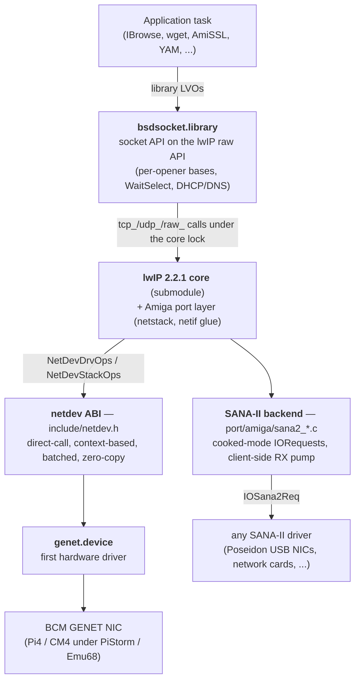

# lwip-amiga — architecture

A modern TCP/IP stack for AmigaOS 3.2 (m68k), built bottom-up as three layers on top of
a fresh network driver ABI:

Two invariants hold across the whole diagram:

- **The stack never hands hardware memory it cannot reach.** On the netdev path the
  stack never allocates packet memory at all: RX buffers are allocated, DMA-filled and
  owned by the driver (the stack borrows them and returns them via a release hook), and
  TX memory is stack-owned but drawn from a DMA allocator the driver provides at attach —
  zero-copy and DMA-correct on a platform where only the driver knows which RAM its
  engine can reach. The SANA-II backend is copy-based by the ABI's own design (the
  driver copies every frame through client callbacks), so its packet memory is plain
  stack-owned heap and no DMA-reachability contract applies.
- **A single core semaphore serializes all lwIP access, and Exec signals do the blocking.**
  There is no lwIP worker thread; callers run stack code in their own context under the
  lock, and blocking sockets sleep on an Exec signal — no lost wakeups.

Scope is IPv4 + TCP + UDP + ICMP + DHCP client + DNS resolver. IPv6 is compiled out.

---

## Layer 1 — `bsdsocket.library` (`src/bsdsocket/`)

The application-facing API, compatible with the AmiTCP/Roadshow contract documented in
NDK 3.2 (`bsdsocket_lib.sfd`). It is a classic AmigaOS **per-opener child-base** library:
the root base holds global state, and each `OpenLibrary()` copies the whole base — jump
table included — so every opening task gets its own `errno`, fd table, wait signal and
`WaitSelect` timer (`main.c` `LibOpen`). `SB_ROOT(base)` reaches the root from any child.

- **Sockets map directly onto lwIP pcbs.** Each `SbSocket` wraps one `tcp_pcb` / `udp_pcb`
  / `raw_pcb`. `socket`→`tcp_new`/`udp_new`/`raw_new`, `connect`→`tcp_connect`,
  `bind`→`tcp_bind`/`udp_bind`, `listen` wires `tcp_accept` (`sb_api.c`, `sb_socket.c`).
- **TX** copies app data into the DMA-backed lwIP heap (`tcp_write(..., COPY)` +
  `tcp_output`; UDP/RAW allocate a `PBUF_RAM`). **RX** keeps the driver's zero-copy pbufs
  until the app buffer — one copy, done with `pbuf_copy_partial`, then `tcp_recved`
  reopens the window.
- **Blocking model** (`sb_socket.c`): lwIP completion callbacks record readiness/events
  under the lock and `Signal()` the owning task. A blocking call clears its signal under
  the lock before waiting, so a wakeup can never be missed. Break signals (Ctrl-C by
  default) surface as `EINTR` and are re-posted. `SO_SNDTIMEO`/`SO_RCVTIMEO` add a
  per-call deadline via the opener's `timer.device` request (`sb_wait_to`).
- **The in-library stack task** (`sb_stack.c`) is a DOS process started under the root's
  open lock by the first `OpenLibrary()`. It reads `ENV:netstack.prefs` (`sb_config.c`:
  **stack-wide settings only** — hostname, search domain, explicit DNS servers, mDNS;
  flat `KEY = VALUE`, every key optional), initializes `netstack`, publishes the
  control port, and ticks `sys_check_timeouts()` every 100 ms. The boot state is
  **loopback only** (the Roadshow model): network interfaces are added at runtime by
  the `AddNetInterface` command from per-interface files in `DEVS:NetInterfaces/`
  (the file name is the interface name), normally from `S:Network-Startup`. The task
  runs at **priority 10** (above the dynamic-scheduler band, matching the driver's
  unit task) so it is not starved by CPU-bound application tasks.
- **A running stack is never expunged — except through the NetShutdown handshake**
  (`main.c` `LibExpunge`). While the stack task exists the library refuses expunge and
  defers with `LIBF_DELEXP`: `lib_OpenCnt` legitimately reaches zero all the time — apps
  that open and close the library around each call do it every few seconds — and
  expunging there would drop the DHCP lease, detach the driver, and unload code the
  driver's unit task still calls through `nda_StackOps`. The one sanctioned way down is
  the control port's SHUTDOWN op (the `NetShutdown` command): the stack asks every
  registered opener to let go (each opener's `SBTC_BREAKMASK` signal), waits for the
  last `CloseLibrary`, tears the interface down, and exits — its final act, under
  `Forbid()`, is the OK reply, upon which `NetShutdown` calls `RemLibrary()` and the
  now-taskless expunge path runs for real. A fresh `OpenLibrary` then reloads the
  library from disk and starts anew (`LibOpen` refuses new clients while a shutdown is
  pending).

The API surface is grouped topically: lifecycle/control (`sb_api.c`), the data path
(`sb_io.c`), options and events (`sb_sockopt.c`), `WaitSelect` (`sb_select.c`), errno
plumbing (`sb_errno.c`), `SocketBaseTagList` (`sb_taglist.c`), address conversion
(`sb_inet.c`), the resolver (`sb_resolver.c`), the netdb tables (`sb_netdb.c`), syslog
(`sb_syslog.c`), socket handoff (`sb_sockpass.c`), DNS configuration
(`sb_dnsconfig.c`) and getaddrinfo (`sb_gai.c`); the generated LVO jump table is
`vectors.c` (139 slots emitted from the SFD by `scripts/gen-vectors.py`).

Interface **status** is read-only (`sb_ifquery.c`): the Roadshow interface-query LVOs
(`ObtainInterfaceList` / `QueryInterfaceTagList`) report the live netif's address, mask,
MTU, MAC, link state and DNS, which the bundled `netinfo` CLI prints ifconfig-style.
Interfaces answer to two names — the Roadshow-style identity from the config file
("genet", stamped into `NetdevIf` at add time) and lwIP's short name ("nd0");
`sb_if_find()` resolves both. The interface-*config* LVOs are declined with `EINVAL`:
runtime configuration runs over the private control port instead (below).

### Runtime control — the netstack control port (`include/netstack_ctl.h`, `sb_netctl.c`)

The stack task owns a public MsgPort, `bsdsocket.netctl`, for its whole lifetime; the
`AddNetInterface` / `RemoveNetInterface` / `NetShutdown` commands drive it with a
versioned message protocol (private to this component — library and tools build
together; the library rejects a version mismatch). Everything is serviced on the stack
task, which serializes all lifecycle work by construction: `OpenDevice` needs a Process,
and a netdev `DoIO` must never run under the core lock.

The reply contract: every delivered message is answered — inline, or *parked* and
answered later. `ADD_IF` executes the attach/configure (`sb_netdev_up`) and parks the
reply until the interface is *operational*: link up for a static config, DHCP lease
bound for a dynamic one (a lease implies link) — checked by the 100 ms tick
(explicitly configured DNS servers are re-applied after a lease so config beats DHCP).
The client owns the timeout: `CANCEL_ADD` recalls a parked add — after a final
readiness check that resolves the cancel-vs-completion race in the add's favor — and
the interface *stays up*, becoming usable when the link or lease arrives (late beats
never). `REM_IF` refuses
with a socket count when connections are still bound to the interface address
(established/listening TCP and bound UDP; TIME_WAIT is stack-owned and ignored) unless
forced. `SHUTDOWN`/`CANCEL_SHUTDOWN` implement the expunge handshake above. Teardown
withdraws the port under `Forbid()` and drains stragglers with `ERR_INACTIVE`, so no
client message is ever lost — which is what lets the commands keep messages on their
own stacks.

## Layer 2 — lwIP core + Amiga port layer (`lwip/`, `port/amiga/`)

lwIP 2.2.1 is a git submodule, forked from `STABLE-2_2_1_RELEASE` — all Amiga-specific
code lives in the port layer, which lwIP is designed to keep separate. The fork carries a
small set of local patches to lwIP's TCP send path, all BSD-3-Clause and written to be
upstreamable: one performance change (the unsent-tail cache below) plus a handful of
correctness fixes to the retransmit/persist path that the throughput campaign surfaced —
resetting `unsent_oversize` on an RTO requeue, never extending a segment already requeued
for retransmission, stopping the persist timer when an ACK empties the unsent queue, and
merging (not concatenating) the queues in `tcp_rexmit_rto_prepare`.

- **The unsent-tail cache** (the performance patch, written to be upstreamable — it
  resolves lwIP's own `@todo` in `tcp_out.c`): `struct tcp_pcb` gains `unsent_tail`,
  a cached pointer to the last node of `pcb->unsent` (invariant: NULL iff `unsent` is
  NULL, maintained at every queue mutation). Before it, `tcp_write` and
  `tcp_enqueue_flags` walked the whole unsent queue per call to find the tail; with
  `TCP_SND_BUF` = 1 MB that queue holds ~700 segments and `tcp_write` runs ~2200×/s
  during a saturated upload, so the O(n) walks were a measured hot spot. A
  walk-and-compare self-check exists behind
  `TCP_UNSENT_TAIL_DBGCHECK` (enabled in the TRACE tier only — it re-adds the
  walk the cache removes).

- **Runtime model** (`lwipopts.h`): `NO_SYS=1` with external serialization — the
  core-locking idea implemented over an Exec `SignalSemaphore` instead of lwIP's own
  `tcpip_thread`. No lwIP code ever runs in interrupt context (Exec semaphores cannot be
  taken from interrupts).
- **The core lock** is the single `netstack.ns_Core` semaphore (`netstack.c`
  `netstack_lock`/`unlock`). It brackets every entry into lwIP and has exactly three
  customers:
  1. **application tasks** — socket calls run stack code in caller context under the lock;
  2. **the driver task** — injects received frames via `netif->input` under the lock;
  3. **the stack task** — runs lwIP timeouts (retransmit, DHCP renew, DNS) only.
- **Time / RNG** (`netstack.c`): `sys_now()` derives monotonic milliseconds from
  the `timer.device` EClock; `LWIP_RAND` is an xorshift.
- **Heap** (`netstack_mem.c`): the lwIP heap
  (`MEM_CUSTOM_*` → `netstack_malloc`/`free`) serves every `PBUF_RAM`/TX payload from
  three slab size classes in one of two disjoint worlds, selected by whether a netdev
  is attached: the **DMA world** (arenas from the active driver's DMA allocator,
  returned at detach) and the **exec world** (`AllocMem` arenas serving SANA-II
  interfaces, the pre-attach window and loopback; they persist until the stack task's
  final teardown). An 8-byte origin header routes every free back to the world that
  allocated it, whichever interface is active by then; only oversize requests take a
  one-off fallback path.

## Layer 3 — netif ↔ netdev glue (`port/amiga/netdev_*.c`)

This binds a lwIP `netif` to a netdev driver — lifecycle in `netdev_if.c`, the
datapaths in `netdev_rx.c`/`netdev_tx.c`. `netdevif_create` allocates the RX wrapper
pool (sized from the driver's advertised `ndc_RxPoolBufs`), adds the netif with
`ethernet_input`, and programs the per-netif checksum switches from the negotiated caps
(disabling lwIP's own TCP/UDP checksum gen/check where the hardware offloads it). The
glue also computes the RX-hold budget the opener declares at ATTACH
(`netdevif_rx_hold_budget`: receive windows × expected streams + slack — port-layer
knowledge the exec side doesn't have).

- **TX** (`ndif_linkoutput`): converts a pbuf chain into a `NetDevSg[]` scatter-gather
  list, computes the L4 checksum start/insert offsets and seeds the pseudo-header,
  `pbuf_ref`s the frame as the completion cookie, and calls `ndo_TxSubmit`. `nso_TxDone`
  frees completed cookies.
- **RX** (`ndif_rx_input`): folds/verifies the RAW checksum of each frame in a pre-pass
  *before* taking the core lock (the fold reads only frame bytes, and `nso_RxInput` runs
  on the driver's unit task alone), then, under the lock, wraps each surviving buffer as
  a zero-copy `pbuf_custom` and feeds `ethernet_input`. Freeing the pbuf calls
  `ndo_RxRelease(cookie)`, recycling the buffer to the driver.
- **Link**: `nso_LinkChange` drives `netif_set_link_up`/`down`.

## Layer 3b — the SANA-II backend (`port/amiga/sana2_*.c`, `src/bsdsocket/sb_sana.c`)

The compatibility backend: the same lwIP netif over a classic SANA-II driver.
Both backends embed **`struct NetIfBase`** (`netif_base.h`) first in their
interface struct — the lwIP netif, a kind tag, the identity block the query
LVOs read, the in-band VLAN TCI and the refcounted joined-multicast MAC set —
so everything backend-agnostic (`sb_ifquery`, the VLAN hooks, the IGMP hook,
the control port) dereferences the base and never cares which driver ABI is
behind it. The stack task resolves the backend per interface at add time:
an explicit `TYPE=NETDEV|SANA2`, or `TYPE=AUTO` (the default) probing with
`NSCMD_DEVICEQUERY` — `NSDEVTYPE_SANA2` means SANA-II, `NETDEV_CMD_ATTACH` in
the command list means netdev, and a device without NSD support is assumed
SANA-II (legacy drivers predate it).

The backend runs the driver in **cooked mode** — lwIP keeps building and
consuming full Ethernet frames, and the glue translates the 14-byte header at
the boundary (RAW frame mode is unreliable across real drivers). SANA-II is
copy-based by construction: the driver copies every frame through
client-supplied callbacks (`S2_CopyToBuff`/`S2_CopyFromBuff`, register-
convention, interrupt-callable — pure copy loops, no Exec calls, no locks).

- **TX** (`sana2_tx.c`): linkoutput, under the core lock, parses the built
  header into `ios2_DstAddr`/`ios2_PacketType` (`S2_BROADCAST`/`S2_MULTICAST`/
  `CMD_WRITE` by destination), refs the pbuf as the `CopyFromBuff` cookie
  (never edited — retransmit-aliased pbufs are cloned, the netdev idiom) and
  stages the write request on a FIFO; the outermost `netstack_unlock` submits
  the batch **quick** (`IOF_QUICK` + direct `BeginIO`, the standard quick-I/O
  contract) — the `netdevif_tx_kick` idiom. A synchronous driver leaves the
  flag set and the write retires in place: no `ReplyMsg`, no pump wakeup, no
  per-frame task switch. A queuing driver clears the flag; only those writes
  reply to the pump. BeginIO under the lock is deadlock-free: SANA-II
  drivers never take `ns_Core`, and the only client code a synchronous
  BeginIO calls back is the lock-free copy callback.
- **RX** (`sana2_pump.c`): SANA-II has no upcall, so a per-interface **pump
  task** (a Process at priority 10, the client-side analog of a netdev
  driver's unit task) keeps typed `CMD_READ`s posted — IPv4 + ARP, plus the
  0x8100 class under VLAN, each owning a heap pbuf with 14 bytes of headroom.
  The read pool covers the **whole announced TCP window** (`TCP_WND/MSS` +
  slack, the `netdevif_rx_hold_budget` rule): a SANA-II driver drops any
  frame that finds no pending read, so anything less loses burst tails.
  Completions are harvested FIFO (delivery order == wire order — TCP depends
  on it) and processed in chunks of 64: one short hold, synthesizes
  the Ethernet header into the headroom, moves the frame out and re-arms the
  request with a fresh pbuf; the reposts then go back to the driver BEFORE
  phase B runs, so the reads are never out of service for the duration of
  TCP input. Between the phases, off the lock, the pump verifies TCP
  checksums in software and classifies frames for the **shared GRO-lite
  engine** (`rx_gro.c`, the same in-order-run merge + pure-ACK coalescing
  the netdev backend uses); phase B then dispatches through the engine
  under the lock (with the netdev fairness yield — every held merge run is
  flushed before any lock release).
- **Lifecycle** (`sb_sana.c`): `S2_DEVICEQUERY` (full-size first, legacy-30
  retry — the two size conventions are mutually exclusive across driver
  generations), Ethernet/48-bit gate, `S2_CONFIGINTERFACE` with the **factory**
  station address (`ios2_DstAddr` — the current address is zeros until first
  configure), `S2_ONLINE`, pump start **before** `netif_set_up` (a static
  config's gratuitous ARP needs the TX reply ports stamped). Link state is
  seeded up (SANA-II has no state query) and tracked thereafter via a
  re-armed `S2_ONEVENT`; drivers without events keep the seeded state.
  Multicast joins push as `S2_ADD/DELMULTICASTADDRESS` deltas against a
  shadow of the last programmed set; stats map `S2_GETGLOBALSTATS` plus
  exact glue-side byte counters into the same neutral cache netdev fills.
  Teardown: netif down + TX gate under one hold, the unlock flushes the
  staged tail, the pump aborts and drains until every request is home —
  after which the driver holds no pointer of ours.

Checksums are software in both directions (SANA-II has no offload): lwIP
generates and verifies everything except inbound TCP, which the pump verifies
off the lock so the GRO-merged headers escape re-verification. Packet memory
comes from the heap's exec-slab world — netdev remains the zero-copy,
offloaded performance path; this backend trades that for compatibility with
every SANA-II driver ever shipped.

---

## The `netdev` driver ABI (`include/netdev.h`)

`netdev` is a clean-break replacement for SANA-II between the stack and NIC drivers. The
header is the normative, permissively-licensed public contract — any driver or stack may
implement it. It follows the fleet's context-ABI idiom (proven by `xhci.device`): ROM-able
drivers carry no writable globals, so every exported call takes an explicit context as its
first argument.

- **Control ops are synchronous `IOStdReq` commands** (`NETDEV_CMD_*`, base `0x8900`):
  ATTACH, START, STOP, DETACH, GET_LINK, GET_STATS, GET_COUNTERS, SET_COALESCE, SET_MAC,
  and the declarative RX filter. They are serialized by the driver's unit task.
  GET_STATS and GET_COUNTERS split the two kinds of statistic and are independent of one
  another: `NetDevStats` is the fixed portable summary (what every NIC has, and what the
  stack cannot work out for itself), while GET_COUNTERS returns a self-describing list of
  whatever that particular driver keeps — the same division Linux draws between
  `rtnl_link_stats64` and `ethtool -S`. A driver reports a figure in both when both
  apply, so either command answers in full on its own. The base sits in
  the NSD third-party command area (the NSD standard reserves `0x4000-0x7FFF` and
  `0xC000-0xFFFF` for the OS); fleet allocations: nvme passthrough `0x8020..0x8024`,
  xhci context ops `0x8800..0x881f`, netdev `0x8900..0x891f`.
- **The datapath is direct C calls**, exchanged once at ATTACH. Two tables cross the
  boundary: `NetDevDrvOps` (driver provides `ndo_TxSubmit`, `ndo_RxRelease`,
  `ndo_DmaAlloc`, `ndo_DmaFree`) and `NetDevStackOps` (stack provides `nso_RxInput`,
  `nso_TxDone`, `nso_LinkChange`). ATTACH negotiates the ABI version and the RX pool:
  the stack declares its concurrent-hold budget (`nda_RxHoldReq`, derived from receive
  windows × expected streams) and the driver answers with the enforced bound in
  `NetDevCaps.ndc_RxPoolBufs` (ring + budget, clamped to its own limits — how many RX
  buffers the stack may hold). Buffer *geometry* stays driver-internal; only the count
  crosses the ABI. ATTACH likewise negotiates the MTU (`nda_MtuReq` in, `ndc_Mtu` out):
  GENET pins 1500, but the field lets a jumbo-capable driver raise it, and
  `NDCF_RX_SCATTER` + `NDRF_SOP`/`NDRF_EOP` reserve multi-buffer RX for frames larger than
  one descriptor — so the frozen ABI covers jumbo without a future layout break.

Design choices worth knowing:

- **Split buffer ownership: driver-owned RX, stack-owned-but-driver-allocated TX.** Only
  the driver knows what its DMA engine reaches, so RX geometry, headroom, ring depth and
  copy-break policy stay entirely driver-internal and never appear in the ABI; the stack
  wraps handed-up buffers as custom pbufs whose free recycles them. TX draws from the
  driver's DMA allocator and submits scatter-gather lists. No lwIP types cross the ABI, no
  bounce buffers, no copies either way.
- **Batched by design.** TX submits an array of descriptors per doorbell; RX delivers a
  batch of filled buffers per lock acquisition; recycling is batched too. Because pbuf
  free runs in application-task context, the driver's recycle path is foreign-task-safe
  (a lock-free SPSC ring).
- **Prefix-consume on both batched paths.** `ndo_TxSubmit` and `nso_RxInput` each return
  an accepted/consumed count — one integer encodes partial success, and the tail is
  unambiguous. TX retry is event-driven: `nso_TxDone` is the "ring has space" signal.
- **Checksum offload is offset-based** (TX carries csum start/insert offsets, not protocol
  enums — protocol-agnostic and exactly what the hardware implements), with two RX modes:
  `CSUM_VALID` for engines that verify and `CSUM_RAW` for engines that just sum (GENET);
  the glue folds RAW sums against the pseudo-header. The IPv4 header checksum stays in
  software.
- **VLAN is in-band software (802.1Q), with hardware offload reserved.** GENET has no HW
  tag insert/strip, so the tag rides inside the frame and lwIP's VLAN hooks tag/filter a
  single configured VID (`VLAN =` prefs key). The checksum offloads stay on for tagged
  frames because the offset helpers key off the VLAN-shifted L3 position (as mainline Linux
  does). The ABI reserves `ntd_VlanTci`/`nrd_VlanTci` + the `NDTF_VLAN_INSERT`/
  `NDRF_VLAN_STRIPPED` flags + `NDCF_VLAN_TX_INSERT`/`NDCF_VLAN_RX_STRIP` caps so a future
  NIC with hardware insert/strip needs no layout break.
- **Cache maintenance is driver-side only** — the driver knows DMA timing and the platform
  contract, keeping the port layer platform-agnostic.
- **Quiesce is exact.** STOP completes every in-flight TX cookie before replying; DETACH
  then requires all RX cookies released and all driver-allocated DMA memory freed, so
  after DETACH no pointer of either side survives in the other.

### Mapping to GENET (the first driver)

| ABI element | GENET reality |
|---|---|
| `NDTF_L4CSUM` + csum start/offset | TSB (transmit status block) offset-based checksum engine (`DMA_TX_DO_CSUM`) |
| `NDRF_CSUM_RAW` + raw sum | RXCHK raw checksum in the 64-byte RSB (`RBUF_64B_EN`) |
| VLAN (`NDCF_VLAN_*` caps) | not advertised — no HW tag offload; tags handled in-band by lwIP |
| `ndc_Mtu` / `nda_MtuReq` | pinned at 1500 (`ENET_MAX_MTU_SIZE` budgets the tag; jumbo not wired) |
| RX headroom for the RSB | driver-internal, never crosses the ABI |
| `ndo_TxSubmit` SG segments | one GENET descriptor per segment; `ndc_TxMaxSegs` bounds a packet |
| `ndo_DmaAlloc` | emu68-common `dma_mem` pool (Emu68 expansion RAM only) |
| `NETDEV_CMD_SET_COALESCE` | DMA ring timeout + MBUF_DONE thresholds |
| RX filter / multicast | MDF exact-match slots, all-multi fallback on overflow |

---

## Platform constraints

These are inputs to every decision above:

- **PiStorm/Emu68 PCIe DMA reaches only the RAM Emu68 itself provides** (pri-40 expansion
  memory) — not Chip RAM, not motherboard or Zorro Fast RAM, and not unaligned buffers.
  Reachability is the emu68-common `dma_mem` predicate, strictly driver-side knowledge —
  hence the stack never `AllocMem`s packet memory; it always comes through the driver's
  DMA allocator.
- **Exec semaphores are task-context only** → no stack entry from interrupts, ever.
- **68k is big-endian = network byte order** → no swapping on header-field access.
- Emu68 RAM is ARM-speed, so the one unavoidable copy (at the socket boundary) is cheap
  when both sides are Emu68 expansion RAM, which applications get by default.

---

## Multiple interfaces — design headroom

v1 drives exactly one NIC, but the design deliberately leaves multi-interface support
unblocked. What is already multi-ready:

- **The ABI is fully per-context**: every `ndo_*`/`nso_*` call carries a context, ATTACH
  is per-unit, and the only identity the ABI carries is `ndc_Mac`. Interface selection —
  (device name, unit) — correctly lives outside the ABI, in the opener.
- **The glue is parameterized**: the netdev glue recovers its `NetdevIf` from `nif->state`
  everywhere; multiple instances would coexist as-is.
- **lwIP and the socket layer iterate**: the multi-netif list is compiled in
  (`NETIF_FOREACH` is already used), DHCP is per-netif, DNS is global by design.
- **The config model is per-interface already**: one `DEVS:NetInterfaces/<name>` file
  per interface, added individually over the control port (`struct NetCtlIfConfig`
  carries everything, and `NetdevIf` carries its own identity) — more interfaces are
  more files plus more ADD messages, no format change anywhere.

The blockers, in ascending difficulty:

1. *Cosmetic*: the fixed netif name `"nd"` and the unconditional `netif_set_default` —
   index the name, make the default route config-driven.
2. *Structural, small*: the single `NetdevIf` embedded in the stack task's context —
   becomes an array of interface slots; the up/down path is already per-add
   (control-port driven), so only the one-slot assumption in `SbStackCtx`/`sb_netctl.c`
   (`ERR_EXISTS` on a second ADD) needs lifting.
3. *The hard one*: `netstack.ns_ActiveNetdev` routes the **entire** lwIP heap — every
   `PBUF_RAM`/TX allocation — to one driver's DMA allocator, and lwIP allocates TX pbufs
   *before* routing picks the egress netif. Preferred resolution: a shared stack-owned
   DMA pool — every candidate NIC on this platform shares the PiStorm PCIe reachability
   constraint and emu68-common's `dma_mem` already encapsulates the predicate + pool —
   at the cost of bending the "TX memory comes from the driver's allocator" doctrine
   (would need an attach-time compatible-allocator capability in the ABI). Fallbacks:
   copy at `linkoutput` when the egress unit differs from the allocating one, or forbid
   heterogeneous DMA domains. **One mix is already safe**: one netdev + one SANA-II
   interface — with a netdev attached every allocation is DMA-reachable by
   construction, and the copy-based SANA-II datapath does not care where its pbufs
   live (frees route home by origin either way).

The gating item is a second netdev driver existing at all (genet is hard-limited to
unit 0), not the stack refactor — revisit when one is real.

---

## Build outputs

Built on the m68k cross-toolchain through the **emu68-driver-stack** superproject (which
supplies the toolchain and `emu68-common`); see the [README](../README.md) for commands.

- `netstack` — a static library: the forked lwIP core (IPv4 only) + the Amiga port
  layer.
- `bsdsocket.library` — the shippable library (`-nostartfiles`, entry `doNotExecute`; a
  library carries no crt0). Runtime version `4.<release>` (see the version note below).
- The **`Netdev`** cmake package — `include/netdev.h` exported as
  `Netdev::netdev_headers`; this is how `genet.device` consumes the contract.
- Diagnostics: `netdev-stats` (a second netdev opener reading live loss-point counters and
  driving `SET_COALESCE`) and `sockbench` (a LAN TCP/UDP throughput benchmark; built but not
  shipped).

**Versioning.** The component/release version lives in the top-level
`project(lwip-amiga VERSION x.y)` and is what the git tag and the stack manifest track.
`bsdsocket.library`'s *runtime* version keeps ABI major **4** (the AmiTCP/Roadshow
contract apps test via `OpenLibrary("bsdsocket.library", 4)`); its revision is derived
from the release version so it increments monotonically (`0.1 → 4.1`, `1.0 → 4.100`).
